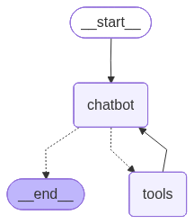
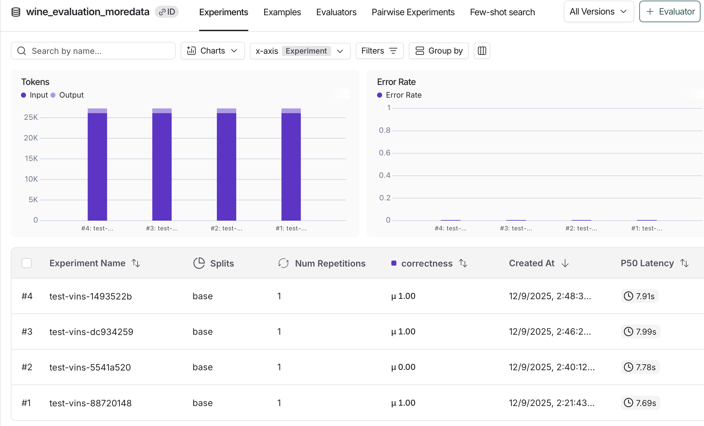
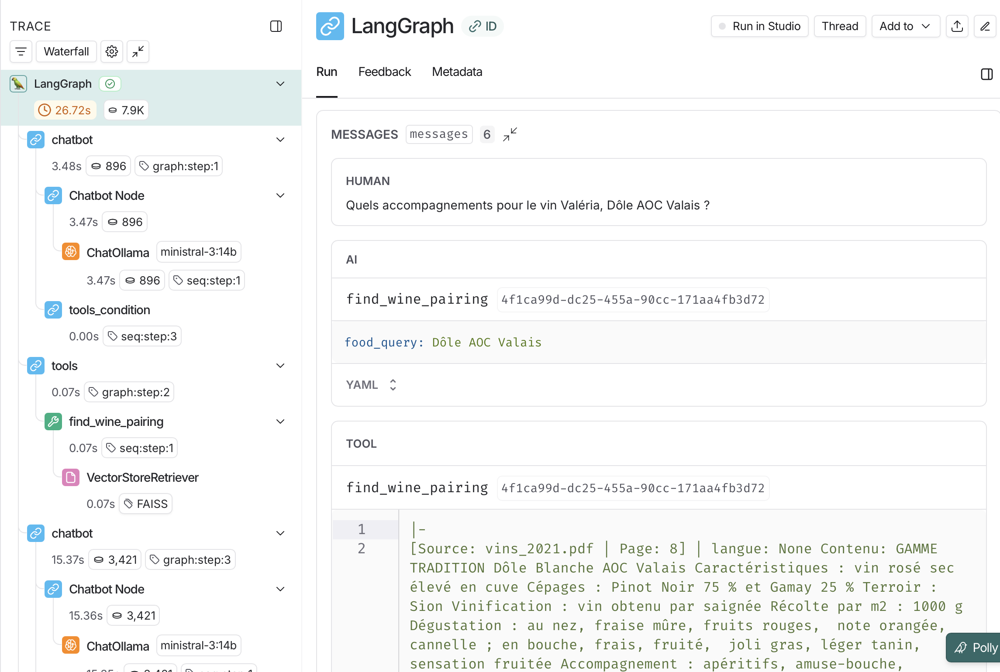

# Developer Guide

## Introduction
This guide provides developers with the necessary information to understand the technical architecture, code structure, and development workflow of the **Ecommerce Assistant** project. It also includes instructions for testing and evaluating the system using **LangSmith**.

---

## Prerequisites

### Required Tools
- **Python 3.12+**
- **Node.js 18+**
- **Ollama** (for the backend LLM)
- **LangSmith Account** (for testing and evaluation)

### Environment Variables
Create a `.env` file in the root directory with the following variables:

Note: This is only required if you plan to use LangSmith for evaluation and tracing. The agent can run without being traced but it is very helpful for debugging and evaluation purposes.

```env
export LANGCHAIN_TRACING_V2="true"           
export LANGCHAIN_API_KEY="<your_langsmith_api_key>"         
export LANGCHAIN_PROJECT="wine-assistant" # project name in LangSmith 
export LANGCHAIN_ENDPOINT="https://api.smith.langchain.com"
```

---

## Code Structure

### Backend
- **`backend/assistant`**:
  - Contains the main logic for the assistant, including tools, data handling, and API endpoints.
  - Main files:
    - `agent.py`: Defines the agent workflow using LangGraph. [^1]
    - `rag.py`: Creates the vectorestore and the retriever later used in some tools.
    - `tools.py`: Implements tools for wine pairing, wine details, and QR code retrieval. [^2]
    - `data_handling/load_data.py`: Handles loading and processing of PDF and web documents. [^3]
    - `api.py`: FastAPI server that exposes endpoints for the frontend to interact with the assistant. Transcribes audio input and processes user queries. [^6]
    - `config.py`: Configuration settings for the backend. You will find the main parameters for the LLM and embeddings here as well as folder paths and the system prompt.
  - The workflow of the agent is illustrated below:
  
  

### Frontend
- **`frontend/src`**:
  - Contains the React-based user interface.
  - Key files:
    - `App.jsx`: Main application component.
    - `App.css`: Styles for the application. [^4]
  - The interface is quite simple and can be easily extended with more features.
  - frontend folder was made using Vite React template:
    ```bash
    npm create vite@latest frontend -- --template react
    ```

### Documentation
- **`docs/`**:
  - Includes user and developer guides.
  - Notes from meetings with professor.
  - Architecture diagrams made with drawio.

---

## Testing and Evaluation

### Using LangSmith
1. Ensure your **LangSmith API key** is set in the `.env` file.
2. Create a dataset:
    - Use `backend/assistant/evaluation/dataset.py` to create a dataset of test queries and expected responses.
    - You can also create them directly in the LangSmith dashboard.
3. Run evaluations using the scripts in `backend/assistant/evaluation/`:
   - `run_eval.py`: Executes evaluation workflows.
   - `evaluate.py`: Contains evaluation logic.
4. View results in your LangSmith dashboard.


These results contain the model responses, the expected responses, and various metrics such as token usage and response time. You can also view the reasoning steps taken by the agent for each query. This is so helpful for debugging and improving the agent's performance as we can see exactly where it went wrong. 



### Running Unit Tests
For the backend, unit tests are located in the `backend/tests/` directory. There are tests for the API endpoints, the html extractor and the documents formatting. Make sure to run the following command at the root of the project and to have the `pytest.ini` file.
- Use `pytest` for backend testing:
  ```bash
  pytest
  ```

---

## Implementation Choices
### LangGraph for Agent Workflow
At first, LangChain was considered for implementing the agent workflow. However, LangGraph was chosen due to its more structured approach to defining workflows. LangChain being more linear made it difficult to implement agent's tool usage. LangGraph's node-based system allowed for clearer representation of the agent's decision-making process. 

### FastAPI for Backend
This was a personal choice as I am more familiar with FastAPI. Its asynchronous capabilities and ease of use made it a suitable choice for building the backend server.

### LLM Selection
`llama3.1:8b` was initially considered because it was lighter and faster to run. However, after testing, llama3.1 showed some issues on tools usage and hallucinations. Therefore, `ministral-3:14b` was chosen for its better performance in understanding and executing tool calls, despite being more resource-intensive. Bigger models like `gpt-oss:20b` were also tested but the performance gain was not significant enough to justify the increased resource usage.

If another model is to be used, make sure it is compatible with Ollama and adjust the model name in `config.py` accordingly.

### React for Frontend
React was chosen as I used it in many previous projects and it offers a good balance between performance and ease of development. Interface can be easily extended with more features as needed. Vite was used as the build tool for its speed and simplicity.

---

## Contributing
Contributions are welcome! Please open an issue or submit a pull request for any improvements or bug fixes.

More tools can be added to the agent by defining them in `tools.py` and adding them to the agent workflow in `agent.py`. 

Text to speech can also be implemented for a fully voice-based interaction.

For now, agent will mainly answer in French, unless asked specifically to speak in another language. This can be optimized.

---

## Sources and References

To do this project, various libraries and tools were used. Here are some of the main sources and references:

[^1]: LangGraph workflow documentation: 
https://docs.langchain.com/oss/python/langgraph/agentic-rag

[^2]: For QR code retrieval zbar library documentation and a tutorial: 
https://note.nkmk.me/en/python-pyzbar-barcode-qrcode/
https://pypi.org/project/pyzbar/

[^3]: For PDF handling, Mr Carrino's RAG Lab was very helpful, as well as the Langchain documentation:
https://docs.langchain.com/oss/python/integrations/document_loaders/pypdfloader
For web scraping, the Langchain's RecursiveUrlLoader was used:
https://docs.langchain.com/oss/python/integrations/document_loaders/recursive_url
For the html extractor, this article was very helpful:
https://www.geeksforgeeks.org/python/extracting-text-from-html-file-using-python/

[^4]: Interface was simple enough, but for the CSS parts, a cheatsheet helped a lot: 
https://nerdcave.com/tailwind-cheat-sheet

[^6]: For audio transcription using openAI's Whisper model, their Github repository contained all documentation needed:
https://github.com/openai/whisper